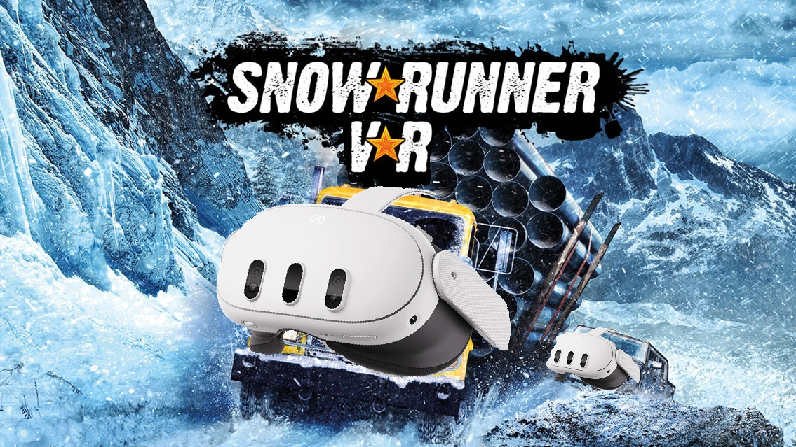

# SnowRunner VR



A 6-DoF VR mod for **SnowRunner** (Steam, DX11), injected as a proxy `dxgi.dll`. It is developed with Claude, and a security audit is periodically performed by the free models of Codex and Gemini Pro without findings (excluding that DLL Proxying can be used as DLL Hijacking in a malicious context, but it's standard practice for modding).
No game files are modified and nothing is patched on disk — delete one DLL and the install is stock again.

## Render options

The game renders in AER, and there are two options to improve smoothness:

| | what it does |
|---|---|
| **Stale-eye warp** | Brings that eye's own last real render forward to now, and fills every pixel the shift could not reach. Three modes: headset rotation only; plus the game camera's rotation; plus a 6-DoF reprojection by the camera's translation. Default on and least graphical issues while still very smooth. One downside is I could not find motion vectors, so I'm using the game camera movement because most of the world is static, and then exclude dynamic elements that could move with the camera (trucks and trailers). This means that these will have some of the AER offsets visible, and in cockpit you will notice the truck cockpit feels in lower fps than the world movement|
| **DIBR shift** | Reprojects the eye that *was* rendered into the other one using the scene depth buffer, so both eyes carry this instant's content. Where it has no source it leaves a disocclusion hole. The hole is filled up with the stale eye warp, it's like a poor mans AFR. Very smooth and I tried to fix most graphical issues I encountered, but some remain. Default off but try it out and let me know how it works for you!|

## Install

1. Download from releases or build `dxgi.dll` (below).
2. Drop it next to `SnowRunner.exe` — on a Steam install that is
   `steamapps\common\SnowRunner\Sources\Bin\`.
3. Start your OpenXR runtime and headset, then launch the game from Steam.

**To uninstall, delete `dxgi.dll`.** That is the whole of it.

Two files appear beside it:

- `snowrunner_vr.log` — truncated each launch.
- `Snowrunner_VR_config.txt` — The settings.

**Set the game to windowed mode. The first launch does little but read your headset and requires a restart.** The mod writes your headset's native per-eye resolution into the config and asks you to restart — the engine builds its window once, at startup, and never re-reads the size, I found no way to apply it live.

## Using it

Open the menu with **Insert**, or **L3+R3** on a gamepad — both rebindable.
**HOME** recenters, as does the button at the top of the menu: face the
direction you want as "forward", then press it.

### Headsets

Tested with my Quest 3 over Virtual Desktop (VDXR and Steam runtime). Anything with an OpenXR runtime should work. I'm curious to see experiences with canted eye headsets, there are probably issues so let me know.

**Turn temporal aliasing off** Only FXAA works.

---

## Build

Requires **Visual Studio 2022 Build Tools** with the MSVC toolset, MASM, and the
"C++ CMake tools for Windows" component. CMake ships inside that component.

```powershell
cmake -S . -B build -G "Visual Studio 17 2022" -A x64
cmake --build build --config Release
```

The DLL lands at `build\Release\dxgi.dll`. Copy it next to `SnowRunner.exe`.

If CMake is not on your PATH it is inside the Build Tools install, typically at
`C:\Program Files (x86)\Microsoft Visual Studio\2022\BuildTools\Common7\IDE\CommonExtensions\Microsoft\CMake\CMake\bin\cmake.exe`.
`CMakePresets.json` is included too, so `cmake --preset vs2022` followed by
`cmake --build --preset release` works.

Dependencies are fetched on the first configure and need no setup:

| | |
|---|---|
| [MinHook](https://github.com/TsudaKageyu/minhook) 1.3.4 | function detours |
| [OpenXR-SDK](https://github.com/KhronosGroup/OpenXR-SDK) 1.1.36 | linked **statically**, so only `dxgi.dll` ships |
| [Dear ImGui](https://github.com/ocornut/imgui) 1.92.9b | the settings overlay |

x64 only — the build fails fast on anything else. Uses the dynamic VC++ runtime
(MSVCP140), which is present on any machine that runs the game.

---

## Layout

```
src/proxy/    the proxy dxgi.dll itself: forwards every export to the real
              System32 one -- documented entry points through C++, the
              undocumented ones through asm jump stubs
src/hooks/    the engine hooks -- swapchain/Present, the camera and view
              builders, the constant buffer, draw calls, depth, input,
              resolution, and the settings menu
src/render/   D3D11 work the mod does itself: the DIBR reprojection, the
              6-DoF reprojection, the UI/smudge/winch composition layers,
              the truck and mirror masks, frame dumps
src/xr/       OpenXR session, swapchains, eye views, layer submission, and
              the AER scheduling
src/common/   logging, the config file, and the pure decision rules that are
              unit-testable without a game or a headset
```

Source comments carry reasoning, including what was tried and did not work.
Several of them cost a session in a headset to establish and are written to stop the same ground being covered twice. Comments may reference `docs/` notes not published here. Many of those contain outdated information on their own and would take a while to clean up.

---

## Acknowledgements

SnowRunner is made by Saber Interactive and published by Focus Entertainment. This is an unofficial, unaffiliated mod. 

The reason this kind of stuff can be made with AI at all is because legends have figured out how to reverse engineer games, engines, and make them into VR experiences. Praydog, Raicuparta, Mutar, Luke Ross, Team Beef and many many more shared code and concepts these models learned from.
